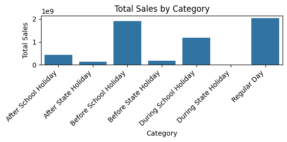
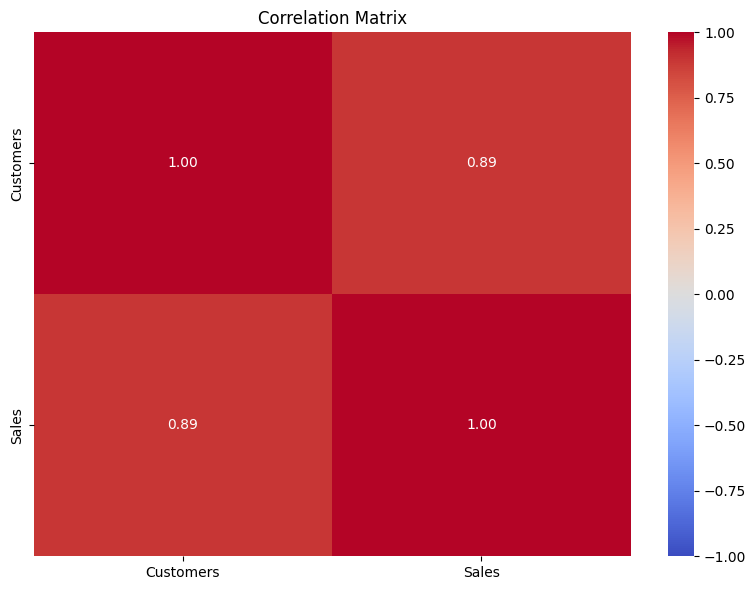
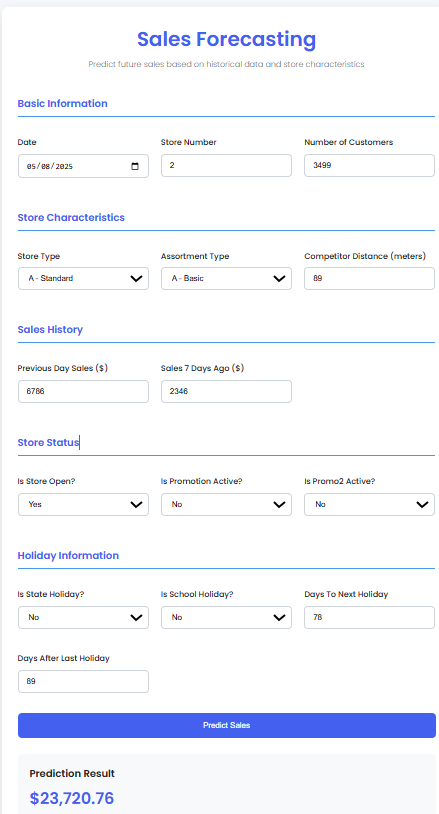

# 📊 Sales Forecasting Project

## 📁 Table of Contents
- [Project Overview](#project-overview)
- [Data Source](#Data_Source)
- [Technologies Used](#technologies-used)
- [EDA](#Insight_from_the_data)
- [Model Details](#model-details)
- [Installation](#installation)
- [Usage](#usage)
- [API Endpoints](#api-endpoints)
- [Contributing](#contributing)
- [License](#license)
## 💡 Project Overview
This project implements a sales forecasting solution using machine learning techniques, specifically a Random Forest model. Initially, an LSTM (Long Short-Term Memory) model was explored, but it did not yield satisfactory results, prompting a shift to the more robust Random Forest algorithm. This project also includes the development of a FastAPI for serving predictions.
The goal of this project is to accurately predict future sales based on historical data. The Random Forest model was chosen for its performance and interpretability. This solution includes data preprocessing, feature engineering, and model evaluation steps, and it serves as a foundation for further improvements and refinements.
## 🗂️  Data Source 
This project uses the Rossmann Store Sales dataset from Kaggle, which contains historical sales data for Rossmann drug stores across Europe.
### 📌 Features:
   - Store metadata (e.g., size, location, competition)

   - Sales data (daily records from 2013–2015)

   - Promotional campaigns and holidays
### 🗃️ Files Used:

   - train.csv - Historical sales data (2013–2015)

   - test.csv - Sales data for forecasting (2015)

   - store.csv - Supplemental store information

## 🛠️ Technologies Used
- Python 🐍  
- pandas 🐼  
- NumPy 🔢  
- scikit-learn 🔬  
- joblib 💾  
- FastAPI ⚡  
- Matplotlib 📊  
- tensorflow 🤖  
- Seaborn 🌊  
- Jupyter Notebook 📓 

## 🔍 EDA 
### 1️⃣ Sales Distribution by befor and after Holiday

   #### 🎯 Highest Sales:
 - Regular Days dominate sales volume (expected baseline).
  - During State Holidays show a noticeable spike, suggesting higher customer turnout during official holidays.
   #### 🏫 School Holidays:
  - Sales are lower during school holidays compared to regular days, possibly due to family travel or reduced local demand.
### 2️⃣ Monthly Sales Trends  
 
  #### 📅 Peak Seasons:
  - Highest sales occur in December (likely due to holiday shopping, year-end promotions).
  - Secondary peaks in May/June (possibly summer season demand) and October (pre-holiday buildup).
### 3️⃣ Feature Correlations  
  
  #### Sales ↔ Customers (0.89):
  - Near-perfect linear relationship—higher foot traffic directly drives sales.
## 🤖 Model Details
 ### 🧠 Model Architecture
   1. Random Forest:
       - Used for baseline modeling with 100 estimators
       - Handles both numerical and categorical features
   2. LSTM (Long Short-Term Memory):
       - Sequence model with 50 hidden units
       - Processes time-series data with a 7-day lookback window
       - Includes dropout layers (p=0.2) for regularization
## 🖼️ Flask App UI

Here’s a preview of the Flask-based web interface:



For more experience, you can refer to this site on Rossmann Sales Prediction.
## 💾 Installation
To set up the project locally, follow these steps:
1. Clone the repository:
   ```bash
   git clone https://github.com/Marta233/Sales_Forcasting.git
   cd sales-forecasting
2. Install the required packages:
```bash
pip install -r requirements.txt
   ```
## 🙋‍♀️ Contributing

Contributions are welcome and appreciated!

If you'd like to contribute, please follow these steps:

1. 🍴 Fork the repository  
2. 🛠️ Create a new branch (`git checkout -b feature/your-feature-name`)  
3. ✍️ Make your changes  
4. ✅ Commit your changes (`git commit -m 'Add your message'`)  
5. 🚀 Push to the branch (`git push origin feature/your-feature-name`)  
6. 🔁 Open a pull request

⭐ If you found this project useful, feel free to give it a star on [GitHub](https://github.com/Marta233/Sales_Forcasting.git)!

Thanks for visiting! 🚀
