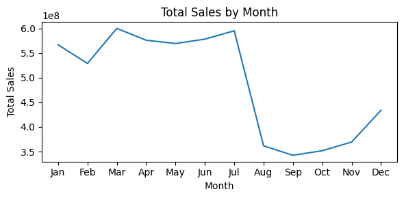

# Sales Forecasting Project
## Table of Contents

- [Project Overview](#project-overview)
- [Data Source](#Data_Source)
- [Technologies Used](#technologies-used)
- [EDA](#Insight_from_the_data)
- [Model Details](#model-details)
- [Installation](#installation)
- [Usage](#usage)
- [API Endpoints](#api-endpoints)
- [Contributing](#contributing)
- [License](#license)
## Project Overview
This project implements a sales forecasting solution using machine learning techniques, specifically a Random Forest model. Initially, an LSTM (Long Short-Term Memory) model was explored, but it did not yield satisfactory results, prompting a shift to the more robust Random Forest algorithm. This project also includes the development of a FastAPI for serving predictions.
The goal of this project is to accurately predict future sales based on historical data. The Random Forest model was chosen for its performance and interpretability. This solution includes data preprocessing, feature engineering, and model evaluation steps, and it serves as a foundation for further improvements and refinements.
## Data Source 
This project uses the Rossmann Store Sales dataset from Kaggle, which contains historical sales data for Rossmann drug stores across Europe.
#### Features:
   - Store metadata (e.g., size, location, competition)

   - Sales data (daily records from 2013–2015)

   - Promotional campaigns and holidays
#### Files Used:

   - train.csv - Historical sales data (2013–2015)

   - test.csv - Sales data for forecasting (2015)

   - store.csv - Supplemental store information

## Technologies Used

- Python
- pandas
- NumPy
- scikit-learn
- joblib
- FastAPI
- Matplotlib
- tensorflow
- Seaborn
- Jupyter Notebook (for experimentation)

## EDA 
### 1. Sales Distribution by Category  
  
   #### Highest Sales:
        - Regular Days dominate sales volume (expected baseline).

        - During State Holidays show a noticeable spike, suggesting higher customer turnout during official holidays.
   #### School Holidays:
       - Sales are lower during school holidays compared to regular days, possibly due to family travel or reduced local demand.
### 2. Monthly Sales Trends  
 
  #### Peak Seasons:
        - Highest sales occur in December (likely due to holiday shopping, year-end promotions).
        - Secondary peaks in May/June (possibly summer season demand) and October (pre-holiday buildup).
### 3. Feature Correlations  
  
  #### Sales ↔ Customers (0.89):
     - Near-perfect linear relationship—higher foot traffic directly drives sales.

Model Details
Model Type: Random Forest
Evaluation Metrics: Mean Absolute Error (MAE) and R² score.
Feature Importance Visualization: The model includes a feature importance analysis to understand which features most significantly impact sales predictions.
API Endpoints
POST /predict
Request body: JSON format containing the necessary features for prediction.
Response: JSON format with the predicted sales.
Example Request
json
Copy code
{
  "feature1": value1,
  "feature2": value2,
  ...
}
Example Response
json
Copy code
{
  "predicted_sales": value
}
Contributing
Contributions are welcome! Please feel free to submit a pull request or open an issue for discussion.


## Installation

To set up the project locally, follow these steps:

1. Clone the repository:

   ```bash
   git clone https://github.com/yourusername/sales-forecasting.git
   cd sales-forecasting
Install the required packages:

bash
Copy code
pip install -r requirements.txt
Usage
Data Preparation:

Place your sales data in the designated directory. The script is designed to load and preprocess the data automatically.
Model Training:

Run the train_model.py script to preprocess the data and fit the Random Forest model.
bash
Copy code
python train_model.py
Making Predictions:

Use the TestSalesForecasting class to make predictions on new test data. Ensure your test data follows the same preprocessing steps as the training data.
Starting the API:

Run the FastAPI application:
bash
Copy code
uvicorn app:app --reload
The API will be available at http://127.0.0.1:8000.


License
This project is licensed under the MIT License. See the LICENSE file for details.

markdown
Copy code

### Notes:
- Replace `yourusername` in the clone URL with your actual GitHub username.
- Ensure that any file names and paths are accurate according to your project structure.
- Add or modify sections as needed to better reflect your project’s specifics.
